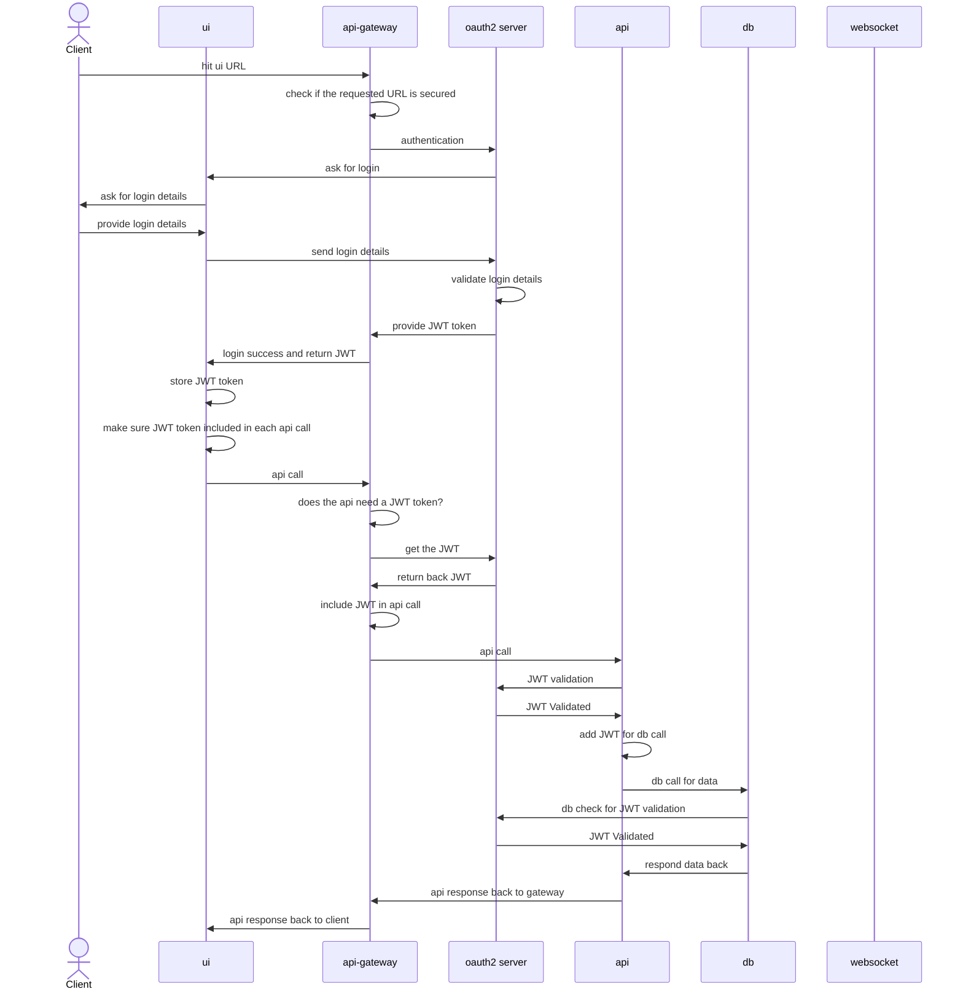

# bff-pattern

```mermaid
sequenceDiagram
    actor Client
    participant ui
    participant Gateway as api-gateway
    participant Oauth2AuthServer as oauth2 server
    participant Api as api
    participant Db as db
    participant WebSocket as websocket
    Client->>Gateway: hit ui URL
    Gateway->>Gateway: check if the requested URL is secured
    Gateway->>Oauth2AuthServer: authentication
    Oauth2AuthServer->>ui: ask for login
    ui->>Client: ask for login details
    Client->>ui: provide login details
    ui->>Oauth2AuthServer: send login details
    Oauth2AuthServer->>Oauth2AuthServer: validate login details
    Oauth2AuthServer->>Gateway: provide JWT token
    Gateway->>ui: login success and return JWT
    ui->>ui: store JWT token
    ui->>ui: make sure JWT token included in each api call 
    ui->>Gateway: api call
    Gateway->>Gateway: does the api need a JWT token?
    Gateway->>Oauth2AuthServer: get the JWT
    Oauth2AuthServer->>Gateway: return back JWT
    Gateway->>Gateway: include JWT in api call
    Gateway->>Api: api call
    Api->>Oauth2AuthServer: JWT validation
    Oauth2AuthServer->>Api: JWT Validated
    Api->>Api: add JWT for db call
    Api->>Db: db call for data
    Db->>Oauth2AuthServer: db check for JWT validation
    Oauth2AuthServer->>Db: JWT Validated
    Db->>Api: respond data back
    Api->>Gateway: api response back to gateway
    Gateway->>ui: api response back to client
    


```
